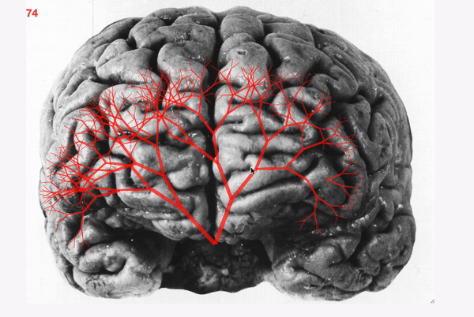

# Brain stem eeg
Using an eeg headset to read attention level a D3 binary tree is generated and grows with higher concentration.

Using the eeg headset that I created [here](https://github.com/greallye/brain-reader-esp8266-mqtt), I wanted to show visually when a users concentration level was going up. 

For this an mqtt libary was used to communicate with the headset.

Using D3.js a binary tree(in this case a binary brain stem) was overlaid onto a picture of a brain to give the impression that the users brain function was growing.

